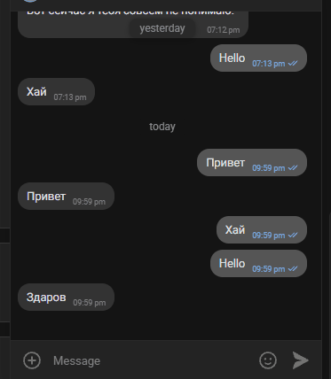

# Support bot — боты поддержки клиентов на DialogFlow

Два чат-бота поддержки для **Telegram** и **ВКонтакте**, которые отвечают клиентам на вопросы компании с помощью **DialogFlow**.

## Что делают боты

Боты принимают сообщения клиентов, распознают намерение через DialogFlow и отвечают готовым ответом из базы знаний компании. Если DialogFlow не понял вопрос — бот возвращает запасную фразу (fallback).



Структура проекта:

- `tg_bot.py` — Telegram-бот на `aiogram` 3 (long polling);
- `vk_bot.py` — бот ВКонтакте на `vk-api` (Long Poll API ВКонтакте);
- `dialogflow_handler.py` — общий модуль для запросов к DialogFlow (используется обоими ботами);
- `create_intent.py` + `training_phrases.json` — скрипт для наполнения базы знаний DialogFlow тренировочными фразами и ответами (запуск: `python create_intent.py`; путь к данным берётся из `INTENTS_FILE`, можно переопределить через `--intents-file` и `--config`).

В базе знаний сейчас один интент — «Устройство на работу» («Как устроиться к вам?», «Хочу работать у вас» и т.п.).

## Что такое DialogFlow

**DialogFlow** — сервис Google Cloud для обработки естественного языка. Вы описываете *намерения* (intents) с набором тренировочных фраз и готовым ответом. Бот отправляет текст клиента в DialogFlow, а тот определяет, какое намерение подходит, и возвращает ответ. Если подходящего намерения нет, срабатывает *fallback* — стандартная фраза-заглушка.

## Примеры работающих ботов


- **Telegram:** [Телеграм Бот](https://t.me/OrcNotificationBot)
- **ВКонтакте:** [ВК бот](https://vk.ru/club241588210)

Что можно проверить: спросить про трудоустройство («Как устроиться на работу?») — бот пришлёт ответ из базы знаний; написать что-то не по теме — бот ответит fallback-фразой.

## Мониторинг ошибок

Оба бота при сбое присылают сообщение с ошибкой вам в Telegram (`TG_BOT_TOKEN` + `TG_CHAT_ID`) через `TelegramLogsHandler` (`tg_logging.py`):

- ошибки в обработчиках сообщений и апдейтов логируются и уходят в Telegram, бот продолжает работать;
- сетевые сбои в VK-бот переживает с повтором через 5 секунд;
- фатальные ошибки логируются, и сервис перезапускается утилитой systemd (`Restart=always`).

Важно: чтобы бот поддержки мог написать вам, откройте с ним чат и нажмите **Start** хотя бы один раз.

## Деплой на сервер через systemd

Клонируйте репозиторий на сервер:

```bash
git clone https://github.com/0rcb0n3-lab/support-bot.git /opt/support-bot
cd /opt/support-bot
```

Создайте виртуальное окружение и установите зависимости:

```bash
python3 -m venv .venv
source .venv/bin/activate
pip install -r requirements.txt
```

Положите в `/opt/support-bot` секреты — файл `.env` (шаблон: `.env.example`) и
`credentials.json` (сервисный аккаунт DialogFlow):

- `TG_BOT_TOKEN` — токен Telegram-бота поддержки;
- `TG_CHAT_ID` — ваш Telegram id, туда будут приходить ошибки;
- `VK_GROUP_TOKEN` — токен группы ВК;
- `GOOGLE_APPLICATION_CREDENTIALS=credentials.json` — путь (относительно каталога проекта) до ключа DialogFlow;
- `DIALOGFLOW_PROJECT_ID`;
- `INTENTS_FILE=training_phrases.json` — путь к файлу с тренировочными фразами (опционально, для скрипта `create_intent.py`);

Установите systemd-юниты:

```bash
sudo cp deploy/support-bot-tg.service deploy/support-bot-vk.service /etc/systemd/system/
sudo systemctl daemon-reload
sudo systemctl enable --now support-bot-tg support-bot-vk
```

Проверьте статус:

```bash
sudo systemctl status support-bot-tg
sudo systemctl status support-bot-vk
```
